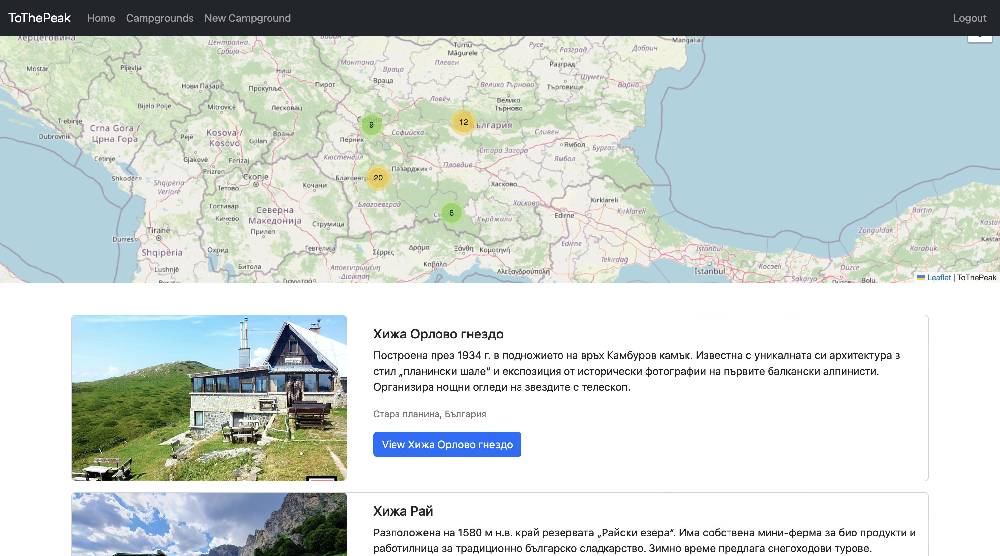
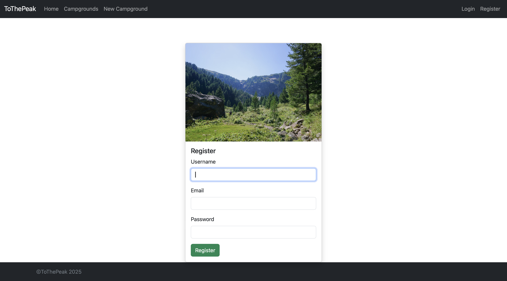
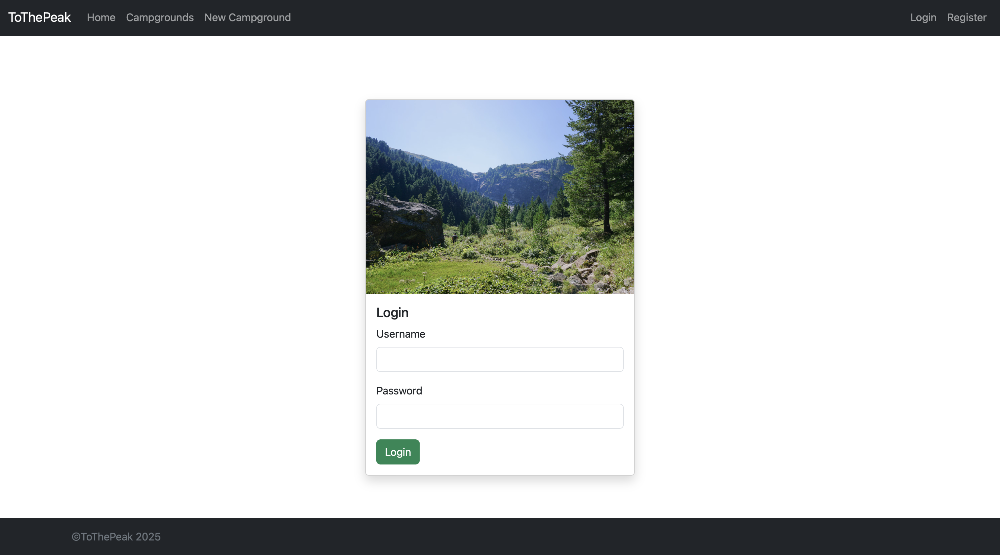
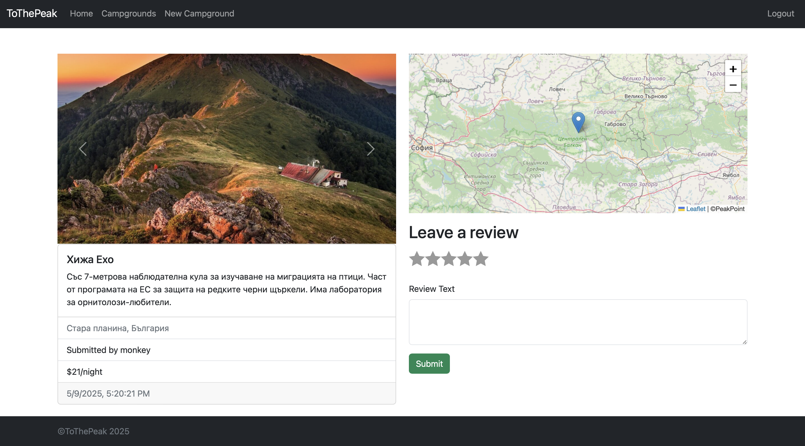
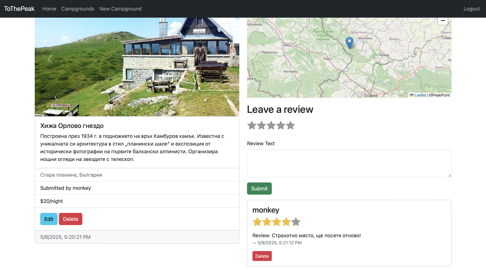
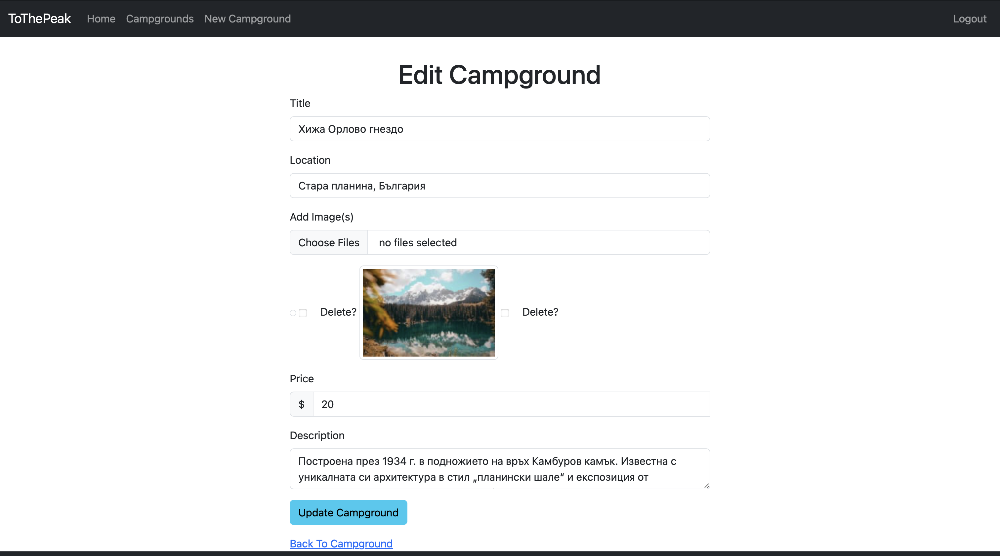
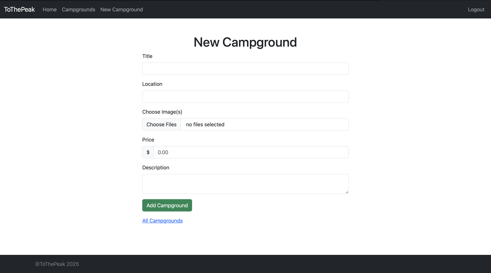

# 🏔️ ToThePeak

A full-stack web application that helps users discover huts and campgrounds in Bulgaria, featuring modern design, user-friendly navigation, and real-time data management.

🌐 **Live demo**: [ToThePeak on Heroku](https://arcane-tor-14011-4246bf83ff13.herokuapp.com)

---

## 🚀 Features

- 🗺️ View and explore huts and camping sites across Bulgaria
- 🔍 Search functionality by name or region
- 🧾 Detail pages for each location with images and descriptions
- ✨ Clean, responsive UI for mobile and desktop
- 🔐 Authentication with Passport.js
- 🗃️ MongoDB Atlas-backed database for storing location info

---

## 🛠️ Built With

**Frontend:**
- HTML, CSS, JavaScript
- EJS (Templating Engine)
- Bootstrap

**Backend:**
- Node.js
- Express.js
- MongoDB (with Mongoose)
- Passport.js (Authentication)
- Cloudinary (Image hosting)
- Session and Flash (Sessions are kept in the database)
- Helmet.js - Security
- Joi - Scheme Validation

**Dev & Deployment:**
- Git & GitHub
- Heroku (Hosting)
- MongoDB Atlas (Database hosting)
- VS Code

---

## 📸 Screenshots

**Home Page**

**Index Page**

**Register Page**

**Login Page**

**Show Page**

**Reviews Look**

**Edit Page**

**New Page**

---

## 🧠 Lessons Learned

During the development of ToThePeak, I deepened my understanding of:
- Full-stack web development (from routing and database models to frontend rendering)
- RESTful APIs and middleware in Express
- User authentication and session management
- Working with cloud-hosted services like Heroku and MongoDB Atlas

---

## 👤 Author

**Hari Altaparmakov**  
📧 [harialta04@gmail.com]  
🌍 Bulgaria  
📱 [Facebook](https://www.facebook.com/harry.alta.3) | [Instagram](https://www.instagram.com/_harry.alta_/)

---

## 📜 License

This project is licensed under the MIT License.
